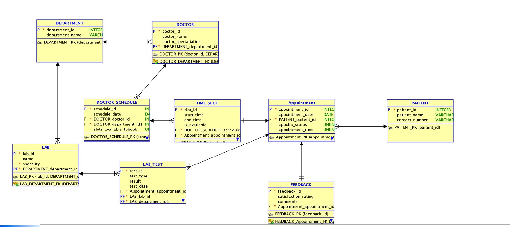

# appointment-booking

# Overview

In today’s dynamic healthcare industry, hospitals face the challenge of booking and managing appointments efficiently. The proposed hospital appointment booking system database is engineered to address these complexities by providing a structured and centralized platform for all pertinent data. The proposed appointment booking system database directly addresses these challenges by offering a structured and centralized repository for all data related to booking appointments. The design includes several key entities: Paitent, Doctor, Receptionalist, Lab_tech, Department_head each with its specific attributes that capture the necessary details for comprehensive Hospital booking system.

## Instructions for script execution

We can start script execution form:
1. Root admin will create APPADMIN user for appication design
2. appointment-booking-table-creation: Script for table creation and data insertion.
3. appointment-booking-views: Script for creating views.
4. appointment-booking-user-creation: Script for creating users.(only creating users wil be done by root admin as appadmin dont have privilages)
5. appointment-booking-read: Script for granting Read access.
6. appointment-booking-write: Script for granting read access.

